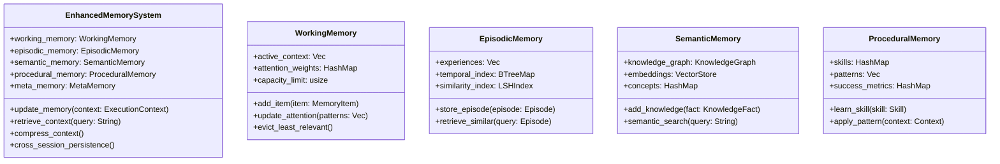

# Agent System Enhancement Design

## Overview

This design document outlines a comprehensive enhancement to the Fluent CLI agent system, transforming it into a truly amazing autonomous AI platform. The enhancement focuses on three core pillars: advanced tool integration, latest LLM provider support, and sophisticated Model Context Protocol (MCP) capabilities. The goal is to create a production-ready agent system that can autonomously handle complex tasks with human-level reasoning, adaptive planning, and seamless tool orchestration.

The enhanced system will leverage cutting-edge AI capabilities including Tree-of-Thought reasoning, hierarchical task decomposition, advanced memory management, and real-time adaptation. It will support the latest LLM models from major providers while maintaining backward compatibility and providing extensible architecture for future innovations.

## Architecture

### Core Agent Architecture Enhancement

The enhanced agent system adopts a multi-layered cognitive architecture that mimics human-like problem-solving patterns:


### Enhanced ReAct Loop with Multi-Modal Reasoning

The enhanced ReAct loop incorporates advanced reasoning strategies and multi-modal processing capabilities:


### Hierarchical Memory Architecture

The enhanced memory system provides multi-level context management with intelligent compression and retrieval:



## Latest LLM Provider Integration

### Multi-Provider Orchestration System

The enhanced system supports the latest LLM models with intelligent provider selection and fallback mechanisms:

| Provider | Latest Models | Capabilities | Integration Status |
|----------|--------------|-------------|-------------------|
| OpenAI | GPT-4 Turbo, GPT-4V, GPT-3.5 Turbo | Text, Vision, Code | Enhanced |
| Anthropic | Claude-3 Opus, Claude-3 Sonnet, Claude-3 Haiku | Text, Reasoning, Safety | Enhanced |
| Google | Gemini Ultra, Gemini Pro, Gemini Nano | Multimodal, Code, Math | Enhanced |
| Mistral | Mistral-Large, Mistral-Medium, Mistral-7B | Multilingual, Code | Enhanced |
| Cohere | Command-R+, Command-R, Embed-v3 | RAG, Embeddings | Enhanced |
| Meta | Llama-2-70B, Code Llama | Open Source, Code | New |
| Perplexity | PPLX-70B-Online, PPLX-7B-Chat | Web Search, Real-time | Enhanced |
| Groq | Mixtral-8x7B, Llama-2-70B | Ultra-fast inference | Enhanced |

### Intelligent Provider Selection


### Enhanced Engine Configuration

```yaml
enhanced_engines:
  - name: "adaptive_gpt4"
    engine: "openai"
    model: "gpt-4-turbo-preview"
    capabilities: ["text", "code", "reasoning"]
    fallback: ["claude-3-opus", "gemini-pro"]
    performance_thresholds:
      latency_ms: 5000
      success_rate: 0.95
    
  - name: "multimodal_gemini"
    engine: "google_gemini"
    model: "gemini-pro-vision"
    capabilities: ["text", "vision", "multimodal"]
    preprocessing:
      image_resize: true
      format_conversion: true
    
  - name: "fast_inference"
    engine: "groq"
    model: "mixtral-8x7b-32768"
    capabilities: ["text", "fast_inference"]
    priority_tasks: ["quick_queries", "real_time_chat"]
```

## Advanced Tool Integration

### Comprehensive Tool Ecosystem

The enhanced tool system provides a rich ecosystem of capabilities for autonomous task execution:

#### Core Tool Categories

1. **File System Tools**
   - Advanced file operations with version control
   - Intelligent search and indexing
   - Automated backup and recovery
   - Cross-platform compatibility

2. **Development Tools**
   - Multi-language compilation and execution
   - Automated testing and validation
   - Code analysis and refactoring
   - Dependency management

3. **Communication Tools**
   - Email and messaging integration
   - API client generation
   - Webhook management
   - Real-time collaboration

4. **Data Processing Tools**
   - Database operations (SQL, NoSQL, Graph)
   - Data transformation and ETL
   - Analytics and visualization
   - Machine learning integration

5. **System Administration Tools**
   - Process management
   - Resource monitoring
   - Security scanning
   - Configuration management

### Enhanced String Replace Editor

The string replace editor is enhanced with AI-powered code understanding:


### Tool Capability Matrix

| Tool Category | Native Support | MCP Support | Plugin Support | Security Level |
|---------------|----------------|-------------|----------------|----------------|
| File Operations | ✅ Enhanced | ✅ Full | ✅ Extensible | 🔒 Sandboxed |
| Shell Commands | ✅ Enhanced | ✅ Full | ✅ Custom | 🔒 Restricted |
| Code Execution | ✅ Multi-lang | ✅ Runtime | ✅ Containers | 🔒 Isolated |
| Network Ops | ✅ HTTP/HTTPS | ✅ Protocols | ✅ Adapters | 🔒 Validated |
| Database | ✅ SQL/NoSQL | ✅ Drivers | ✅ Custom | 🔒 Authenticated |
| AI/ML | ✅ Inference | ✅ Models | ✅ Frameworks | 🔒 Rate Limited |

## Model Context Protocol (MCP) Integration

### Advanced MCP Architecture

The enhanced MCP integration provides seamless interoperability between agents and external tools:


### Enhanced MCP Features

#### Protocol Extensions
- **Streaming Support**: Real-time data streaming for large operations
- **Batch Operations**: Efficient bulk operations
- **Transaction Support**: ACID compliance for critical operations
- **Event Subscriptions**: Real-time notifications and updates

#### Advanced Tool Discovery
```rust
pub struct EnhancedMcpRegistry {
    pub tools: HashMap<String, McpToolDefinition>,
    pub capabilities: CapabilityMatrix,
    pub performance_metrics: HashMap<String, PerformanceMetrics>,
    pub compatibility_map: HashMap<String, Vec<String>>,
}

impl EnhancedMcpRegistry {
    pub async fn discover_tools(&mut self) -> Result<Vec<McpToolDefinition>> {
        // Enhanced discovery with capability negotiation
    }
    
    pub async fn select_optimal_tool(&self, task: &Task) -> Result<String> {
        // AI-powered tool selection based on task requirements
    }
    
    pub async fn load_balance_requests(&self) -> Result<String> {
        // Intelligent load balancing across tool instances
    }
}
```

#### Multi-Transport Support

| Transport | Use Case | Performance | Security |
|-----------|----------|-------------|----------|
| WebSocket | Real-time communication | High | TLS/WSS |
| HTTP/HTTPS | Standard operations | Medium | HTTPS/OAuth |
| gRPC | High-performance services | Highest | mTLS |
| Unix Sockets | Local tool communication | Highest | File permissions |
| Named Pipes | Windows local tools | High | ACLs |

### MCP Security Framework


## Performance Optimization

### Multi-Level Caching Strategy

```mermaid
flowchart TD
    A[Request] --> B{L1 Cache Hit?}
    B -->|Yes| C[Return Cached Result]
    B -->|No| D{L2 Cache Hit?}
    D -->|Yes| E[Update L1, Return Result]
    D -->|No| F{L3 Cache Hit?}
    F -->|Yes| G[Update L2 & L1, Return Result]
    F -->|No| H[Execute Operation]
    H --> I[Update All Cache Levels]
    I --> J[Return Result]
    
    subgraph "Cache Levels"
        K[L1: In-Memory (1s-60s TTL)]
        L[L2: Redis/Local DB (1m-1h TTL)]
        M[L3: Persistent Storage (1h-24h TTL)]
    end
```

### Parallel Execution Framework

The enhanced system supports sophisticated parallel execution patterns:

| Pattern | Use Case | Coordination | Error Handling |
|---------|----------|--------------|----------------|
| Fork-Join | Independent subtasks | Synchronization barriers | Partial failure tolerance |
| Pipeline | Sequential data processing | Producer-consumer queues | Rollback capability |
| Map-Reduce | Large data processing | Shuffle and reduce phases | Retry and recovery |
| Event-Driven | Reactive processing | Event bus coordination | Circuit breakers |

### Resource Management

```rust
pub struct ResourceManager {
    pub cpu_limits: CpuLimits,
    pub memory_limits: MemoryLimits,
    pub network_limits: NetworkLimits,
    pub storage_limits: StorageLimits,
    pub active_operations: HashMap<String, OperationHandle>,
}

impl ResourceManager {
    pub async fn allocate_resources(&mut self, operation: &Operation) -> Result<ResourceAllocation> {
        // Intelligent resource allocation based on operation requirements
    }
    
    pub async fn monitor_usage(&self) -> ResourceUsage {
        // Real-time resource monitoring and alerting
    }
    
    pub async fn enforce_limits(&mut self) -> Result<()> {
        // Proactive limit enforcement with graceful degradation
    }
}
```

## Testing Strategy

### Comprehensive Test Framework


### Test Coverage Goals

| Component | Unit Tests | Integration Tests | Performance Tests | Security Tests |
|-----------|------------|-------------------|-------------------|----------------|
| ReAct Loop | ≥95% | ✅ Full Scenarios | ✅ Latency/Throughput | ✅ Input Validation |
| Tool System | ≥90% | ✅ MCP Integration | ✅ Resource Usage | ✅ Sandbox Testing |
| Memory System | ≥95% | ✅ Persistence Tests | ✅ Memory Efficiency | ✅ Data Protection |
| LLM Providers | ≥85% | ✅ All Providers | ✅ Rate Limiting | ✅ API Security |
| MCP Framework | ≥90% | ✅ Transport Tests | ✅ Connection Handling | ✅ Protocol Security |

### Automated Testing Pipeline

```yaml
test_pipeline:
  stages:
    - name: "unit_tests"
      parallel: true
      commands:
        - "cargo test --lib"
        - "cargo test --bins"
        - "cargo clippy --all-targets"
    
    - name: "integration_tests"
      dependencies: ["unit_tests"]
      commands:
        - "cargo test --test integration_tests"
        - "cargo test --test mcp_integration_tests"
    
    - name: "performance_tests"
      dependencies: ["integration_tests"]
      commands:
        - "cargo test --test performance_tests --release"
        - "cargo bench"
    
    - name: "security_tests"
      dependencies: ["integration_tests"]
      commands:
        - "./scripts/security_audit.sh"
        - "cargo audit"
    
    - name: "e2e_tests"
      dependencies: ["performance_tests", "security_tests"]
      commands:
        - "cargo test --test e2e_tests"
```

## Security Framework

### Multi-Layered Security Architecture


### Security Controls Matrix

| Security Control | Implementation | Monitoring | Compliance |
|------------------|----------------|------------|------------|
| Input Validation | Regex + Schema validation | Real-time alerts | OWASP compliance |
| Command Injection | Whitelist + Sandboxing | Behavioral analysis | Security standards |
| Data Protection | AES-256 encryption | Access monitoring | GDPR/CCPA ready |
| Authentication | OAuth2 + JWT tokens | Failed attempt tracking | Industry standards |
| Authorization | RBAC + Capabilities | Permission auditing | Principle of least privilege |
