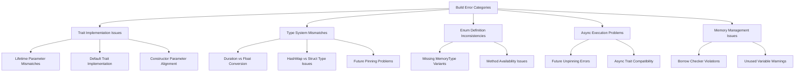
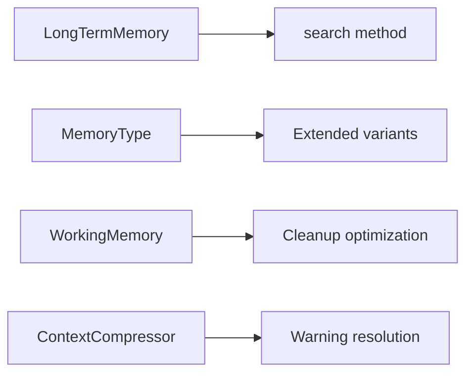
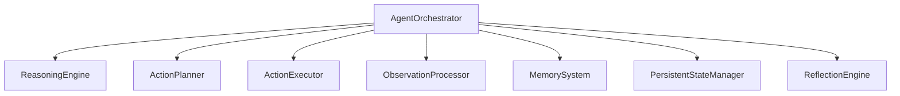

# Cargo Test Fix Design

## Overview

This design addresses the comprehensive resolution of build errors and warnings preventing successful test execution in the fluent-agent crate. The errors span multiple categories including trait implementation mismatches, type compatibility issues, missing enum variants, and various compiler warnings.

## Architecture

The fix targets several core architectural components:



## Error Classification and Resolution Strategy

### Category 1: Trait Implementation Compatibility Issues

#### Lifetime Parameter Mismatches (E0195)
**Problem**: Methods in trait implementations have different lifetime parameters than trait declarations.

**Files Affected**:
- `crates/fluent-agent/src/benchmarks.rs:138`
- `crates/fluent-agent/src/memory/mod.rs:160`

**Resolution Strategy**:
- Remove explicit lifetime parameters from implementation methods
- Ensure trait method signatures match exactly
- Use `&self` and `&Request` without additional lifetime annotations

#### Default Trait Implementation (E0277)
**Problem**: `dyn ActionExecutor` does not implement `Default` trait.

**Files Affected**:
- `crates/fluent-agent/src/benchmarks.rs:413`

**Resolution Strategy**:
- Create a concrete default implementation for ActionExecutor
- Implement factory pattern for default action executor creation
- Use explicit constructor instead of `Default::default()`

### Category 2: Constructor and Function Signature Issues

#### AgentOrchestrator Constructor Mismatch (E0061)
**Problem**: `AgentOrchestrator::new()` expects 7 parameters but receives 3.

**Files Affected**:
- `crates/fluent-agent/src/benchmarks.rs:413`

**Resolution Strategy**:
- Analyze required constructor parameters from orchestrator.rs
- Create all required components (ReasoningEngine, ActionPlanner, etc.)
- Implement proper dependency injection pattern

### Category 3: Type System Alignment

#### Duration vs Float Type Mismatches (E0308)
**Problem**: Expected `Duration` type but found floating-point numbers.

**Files Affected**:
- `crates/fluent-agent/src/monitoring/adaptive_strategy.rs:431,454,477`

**Resolution Strategy**:
- Convert float values to Duration using `Duration::from_secs_f64()`
- Update ExpectedPerformance struct initialization
- Ensure all timing-related fields use proper Duration types

#### HashMap vs ResourceRequirements Type Issues (E0308)
**Problem**: Expected `ResourceRequirements` struct but found `HashMap<String, f64>`.

**Files Affected**:
- `crates/fluent-agent/src/monitoring/adaptive_strategy.rs:434,457,480`

**Resolution Strategy**:
- Define proper ResourceRequirements struct construction
- Replace HashMap initialization with struct field assignment
- Ensure type compatibility across resource management

### Category 4: Enum Definition Synchronization

#### Missing MemoryType Variants (E0599)
**Problem**: `MemoryType` enum missing `Strategy`, `Pattern`, `Rule`, and `Fact` variants.

**Files Affected**:
- `crates/fluent-agent/src/mcp_adapter.rs:196-199`

**Resolution Strategy**:
- Add missing variants to MemoryType enum definition
- Ensure variant names match usage in mcp_adapter.rs
- Update enum handling logic for new variants

#### Missing Method Implementation (E0599)
**Problem**: `Arc<dyn LongTermMemory>` missing `search` method.

**Files Affected**:
- `crates/fluent-agent/src/mcp_adapter.rs:262`

**Resolution Strategy**:
- Add `search` method to LongTermMemory trait
- Implement method in concrete implementations
- Ensure async compatibility with existing patterns

### Category 5: Async Execution and Future Handling

#### Future Unpinning Issues (E0277)
**Problem**: Futures cannot be unpinned for await operations.

**Files Affected**:
- `crates/fluent-agent/src/benchmarks.rs:539,192`

**Resolution Strategy**:
- Use `Box::pin()` for dynamic future creation
- Implement proper Pin<Box<>> wrapping
- Apply async trait patterns consistently

#### Borrow Checker Violations (E0502)
**Problem**: Simultaneous mutable and immutable borrows.

**Files Affected**:
- `crates/fluent-agent/src/memory/cross_session_persistence.rs:474`

**Resolution Strategy**:
- Restructure borrowing to avoid conflicts
- Use temporary variables for length calculation
- Apply RAII patterns for resource management

## Implementation Details

### Trait Signature Standardization

```rust
// Standardized async trait implementation pattern
#[async_trait]
impl ActionExecutor for ConcreteExecutor {
    async fn execute(&self, request: &Request) -> Result<Response> {
        // Implementation without explicit lifetimes
    }
}
```

### Constructor Parameter Resolution

```rust
// Complete AgentOrchestrator construction
let orchestrator = AgentOrchestrator::new(
    reasoning_engine,      // Box<dyn ReasoningEngine>
    action_planner,       // Box<dyn ActionPlanner>
    action_executor,      // Box<dyn ActionExecutor>
    observation_processor, // Box<dyn ObservationProcessor>
    memory_system,        // Arc<MemorySystem>
    persistent_state_manager, // Arc<PersistentStateManager>
    reflection_engine,    // ReflectionEngine
).await?;
```

### Type System Corrections

```rust
// Duration type conversion
ExpectedPerformance {
    execution_time: Duration::from_secs_f64(2.0),
    success_rate: 0.95,
    efficiency: 0.85, // Add missing field
}

// ResourceRequirements proper construction
ResourceRequirements {
    memory_mb: 50.0,
    cpu_percent: 30.0,
    // Additional fields as defined in struct
}
```

### Enum Extension Pattern

```rust
#[derive(Debug, Clone, Serialize, Deserialize)]
pub enum MemoryType {
    Episodic,
    Semantic,
    Procedural,
    Strategy,   // Add missing variant
    Pattern,    // Add missing variant
    Rule,       // Add missing variant
    Fact,       // Add missing variant
}
```

## Testing Strategy

### Error Verification Process

1. **Incremental Compilation**: Fix errors category by category
2. **Trait Compatibility Testing**: Verify all trait implementations match declarations
3. **Type System Validation**: Ensure all type conversions are explicit and correct
4. **Async Pattern Verification**: Test all async/await patterns for proper execution

### Warning Elimination Approach

1. **Unused Import Removal**: Clean up all unused imports
2. **Variable Usage Optimization**: Prefix unused variables with underscore
3. **Mutability Optimization**: Remove unnecessary `mut` declarations
4. **Assignment Usage Verification**: Ensure assigned values are actually used

## Component Integration

### Memory System Integration



### Orchestrator Integration



## Code Quality Improvements

### Warning Resolution Categories

1. **Unused Imports**: Remove `std::collections::HashMap` and `GoalPriority` imports
2. **Unused Variables**: Prefix with underscore or restructure code to use them
3. **Unused Assignments**: Ensure assigned values are utilized or remove assignments
4. **Unnecessary Mutability**: Remove `mut` where variables are not modified

### Error Prevention Patterns

1. **Explicit Type Annotations**: Add type hints where compiler needs guidance
2. **Proper Resource Management**: Use RAII patterns for complex resource handling
3. **Async Trait Consistency**: Apply `#[async_trait]` patterns uniformly
4. **Future Handling**: Use consistent pinning and boxing for dynamic futures