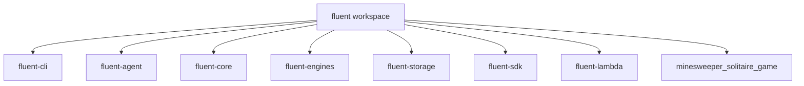
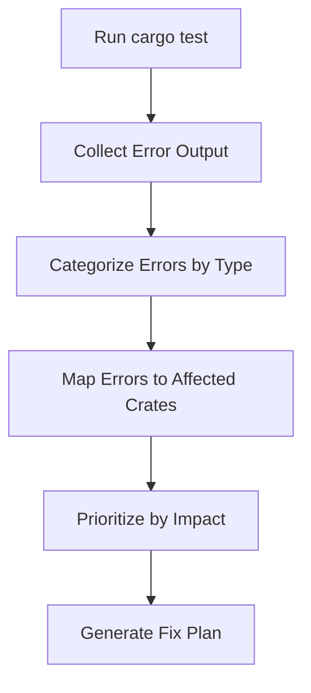
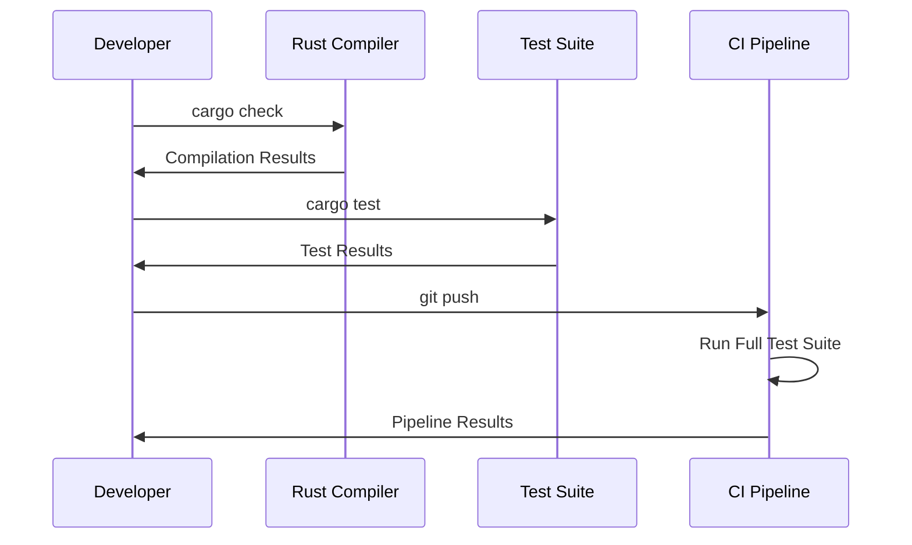

# Cargo Test Compilation Fixes Design

## Overview

This design document outlines the comprehensive approach to resolve all compilation warnings and errors for `cargo test` in the Fluent CLI project. The Fluent CLI is a Rust-based workspace with multiple crates that may have various compilation issues affecting test execution.

## Repository Analysis

**Repository Type**: CLI Tool (Rust Workspace)
- Multi-crate Rust workspace with 7 main crates
- Core functionality: LLM interaction, agentic workflows, MCP integration
- Test coverage across all crates with both unit and integration tests

## Architecture

### Workspace Structure


### Error Categories

#### Type System Issues
- Trait implementation mismatches
- Async trait compatibility problems
- Return type inconsistencies
- Generic type parameter conflicts

#### Dependency Issues
- Version conflicts between workspace dependencies
- Missing features in dependency declarations
- Circular dependency problems
- Feature flag misalignment

#### Test-Specific Issues
- Test module compilation failures
- Missing test dependencies
- Async test configuration problems
- Mock setup and teardown issues

#### Rust Edition and Language Issues
- Deprecated syntax usage
- Unsafe code blocks requiring review
- Lifetime parameter mismatches
- Pattern matching exhaustiveness

## Error Resolution Strategy

### Phase 1: Diagnostic Analysis


### Phase 2: Systematic Fixes

#### Trait Implementation Fixes
- Use `#[async_trait]` macro for async methods in trait objects
- Ensure return types match trait definitions exactly
- Convert `Pin<Box<dyn Future>>` to `Box<dyn Future>` when required
- Implement missing trait bounds and where clauses

#### Default Implementation Patterns
```rust
// SystemTime Default implementation
impl Default for StructWithSystemTime {
    fn default() -> Self {
        Self {
            timestamp: SystemTime::UNIX_EPOCH,
            // ... other fields
        }
    }
}
```

#### Type Conversion Corrections
- Use explicit type annotations for numeric operations
- Wrap values in `Some()` for `Option<T>` type matches
- Use appropriate constructors like `Duration::from_millis`
- Handle enum variant additions and removals

#### Dependency Resolution
- Align feature flags across workspace dependencies
- Remove duplicate struct definitions causing E0428 errors
- Ensure all required dependencies are declared in Cargo.toml
- Update version constraints for compatibility

### Phase 3: Test Infrastructure Fixes

#### Test Module Structure
```rust
#[cfg(test)]
mod tests {
    use super::*;
    
    #[tokio::test]
    async fn test_async_functionality() {
        // Async test implementation
    }
    
    #[test]
    fn test_sync_functionality() {
        // Sync test implementation
    }
}
```

#### Mock and Test Utilities
- Implement proper mock objects for external dependencies
- Setup test fixtures and cleanup procedures
- Configure test-specific feature flags
- Handle test environment isolation

### Phase 4: Validation and Verification

#### Continuous Validation Process


#### Quality Gates
- All compilation warnings resolved
- Zero test failures
- Performance regression checks
- Memory safety validation
- Security audit passes

## Testing Strategy

### Unit Testing
- Test individual functions and methods
- Mock external dependencies
- Validate error handling paths
- Check edge cases and boundary conditions

### Integration Testing
- Test inter-crate communication
- Validate configuration loading
- Test MCP client-server interactions
- Verify pipeline execution flows

### End-to-End Testing
- CLI command execution
- Full workflow validation
- Configuration file processing
- Agent goal execution

## Implementation Approach

### Error Fix Prioritization
1. **Critical Compilation Errors** - Prevent any compilation
2. **Test Module Errors** - Block test execution
3. **Warning Cleanup** - Code quality improvements
4. **Performance Optimizations** - Runtime efficiency

### Code Quality Standards
- Follow Rust idioms and best practices
- Maintain comprehensive error handling
- Use `Result<T, E>` pattern consistently
- Implement proper logging with `tracing` crate
- Document public APIs with doc comments

### Security Considerations
- Validate all inputs in test scenarios
- Use secure random number generation in tests
- Avoid hardcoded secrets in test data
- Implement proper cleanup in test teardown

## Risk Mitigation

### Compilation Risk Factors
- **Breaking Changes**: Dependency updates causing API changes
- **Feature Conflicts**: Incompatible feature flag combinations
- **Platform Issues**: OS-specific compilation problems
- **Memory Safety**: Unsafe code blocks requiring validation

### Mitigation Strategies
- Incremental fix approach with validation at each step
- Comprehensive test coverage for fixed components
- Documentation of breaking changes and migration paths
- Regular dependency audits and updates

## Monitoring and Maintenance

### Continuous Monitoring
- Automated test execution in CI pipeline
- Dependency vulnerability scanning
- Performance benchmark tracking
- Code coverage reporting

### Maintenance Procedures
- Regular dependency updates with compatibility testing
- Periodic code quality audits
- Security patch application process
- Documentation updates for API changes