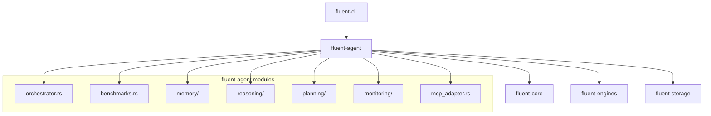

# Rust Build Fixes Design Document

## Overview

This document outlines a comprehensive plan to resolve all build warnings and compile errors in the Fluent CLI project, specifically targeting the `fluent-agent` crate. The errors span multiple categories including duplicate definitions, missing implementations, incorrect type signatures, and unused imports.

## Technology Stack & Dependencies

The project uses Rust 2021 edition with the following key dependencies:
- **Async Runtime**: Tokio for async/await functionality
- **Serialization**: Serde with JSON support
- **Database**: Neo4j integration via fluent-core
- **Error Handling**: Anyhow for error propagation
- **Memory Management**: Standard Rust ownership model

## Architecture

The Fluent CLI follows a modular crate-based architecture:


## Error Categories Analysis

### 1. Duplicate Definitions
- **ReasoningResult** struct defined twice in `orchestrator.rs`
- Conflicting trait implementations (Clone, Debug)

### 2. Missing Type Imports
- `Neo4jClient` not found in `fluent_core::types`
- Missing trait imports for method resolution

### 3. Trait Implementation Issues
- Lifetime parameter mismatches in Engine trait implementations
- Incorrect return types (Pin vs Box for async methods)
- Missing trait methods in implementations

### 4. Struct Field Mismatches
- Goal struct missing expected fields
- MemoryItem, MemoryQuery field mismatches
- UpsertResponse structure inconsistencies

### 5. Type Compatibility Issues
- SystemTime vs DateTime conversions
- Numeric type ambiguity in clamp operations
- Future trait object compatibility

### 6. Unused Imports and Variables
- Multiple unused import warnings
- Unused variables in method parameters

## Detailed Fix Implementation

### ReasoningResult Duplication Fix

```rust
// Remove duplicate ReasoningResult definition
// Keep only the first definition with complete derive attributes
#[derive(Debug, Clone, Serialize, Deserialize)]
pub struct ReasoningResult {
    pub reasoning_output: String,
    pub confidence_score: f64,
    pub goal_achieved_confidence: f64,
    pub next_actions: Vec<String>,
}
```

### Neo4jClient Import Resolution

```rust
// Add proper import at the top of benchmarks.rs
use fluent_core::neo4j_client::Neo4jClient;

// Update method signature
fn get_neo4j_client(&self) -> Option<&std::sync::Arc<Neo4jClient>> {
    None
}
```

### Engine Trait Implementation Fixes

```rust
// Fix async method return types to use Box instead of Pin
impl Engine for BenchmarkEngine {
    fn upsert<'a>(&'a self, _request: &'a UpsertRequest) 
        -> Box<dyn Future<Output = Result<UpsertResponse>> + Send + 'a> {
        Box::new(async move {
            Ok(UpsertResponse {
                processed_files: vec![],
                errors: vec![],
            })
        })
    }

    fn upload_file<'a>(&'a self, _path: &'a std::path::Path) 
        -> Box<dyn Future<Output = Result<String>> + Send + 'a> {
        Box::new(async move {
            Ok("Mock upload".to_string())
        })
    }

    fn process_request_with_file<'a>(&'a self, _request: &'a Request, _path: &'a std::path::Path) 
        -> Box<dyn Future<Output = Result<Response>> + Send + 'a> {
        Box::new(async move {
            self.execute(_request).await
        })
    }
}
```

### Goal Structure Updates

```rust
// Update Goal struct creation
let goal = Goal {
    max_iterations: Some(100),
    timeout: Some(Duration::from_secs(300)),
    metadata: std::collections::HashMap::new(),
};

// Update ExecutionContext creation
let mut context = ExecutionContext::new(goal);
```

### MemoryItem Structure Alignment

```rust
// Update MemoryItem creation to match actual struct definition
let memory_item = MemoryItem {
    item_id: uuid::Uuid::new_v4().to_string(),
    content: MemoryContent::Text(content.to_string()),
    metadata: ItemMetadata::default(),
    relevance_score: 1.0,
    attention_weight: 1.0,
    consolidation_level: 0,
    created_at: SystemTime::now(),
    last_accessed: SystemTime::now(),
};
```

### Memory Query Structure Fix

```rust
// Update MemoryQuery to match actual structure
let memory_query = MemoryQuery {
    content_types: vec![],
    time_range: None,
    limit: Some(10),
    min_relevance: importance_threshold,
};
```

### Numeric Type Ambiguity Resolution

```rust
// Fix clamp operation with explicit type annotation
pub fn calculate_performance_score(&self) -> Result<f64> {
    let mut score: f64 = 0.5; // Base score
    // ... calculation logic ...
    Ok(score.clamp::<f64>(0.0, 1.0))
}
```

### DateTime Conversion Fixes

```rust
// Convert DateTime to SystemTime
created_at: chrono::Utc::now().into(),
last_accessed: chrono::Utc::now().into(),
```

### Trait Import Additions

```rust
// Add missing trait imports
use crate::reasoning::ReasoningEngine;
use std::cmp::PartialEq;

// Add PartialEq derive to ErrorType
#[derive(PartialEq)]
pub enum ErrorType {
    // existing variants
}
```

### Unused Import Cleanup

Remove unused imports across all files:
- `json` from serde_json
- `HashMap` from std::collections where unused
- Various unused performance and task imports
- Path from std::path where unused

### Missing Trait Method Implementations

```rust
impl Engine for MockMemoryEngine {
    // Implement all required methods
    fn get_session_id(&self) -> Option<String> { None }
    fn extract_content(&self, _: &JsonValue) -> Option<ExtractedContent> { None }
    // ... other required methods
}
```

## Testing Strategy

### Unit Testing Approach
- Create isolated tests for each fixed component
- Mock external dependencies (Neo4j, LLM engines)
- Test error handling paths

### Integration Testing
- Verify trait implementations work correctly
- Test memory system integration
- Validate reasoning engine functionality

### Compilation Verification
```bash
# Incremental compilation check
cargo check --all-targets

# Full build verification
cargo build --release

# Run tests to ensure functionality
cargo test --all
```

## Implementation Priority

1. **High Priority** (Blocking compilation):
   - Remove duplicate ReasoningResult definition
   - Fix Neo4jClient import issues
   - Correct Engine trait implementations
   - Fix Goal and ExecutionContext constructors

2. **Medium Priority** (Type safety):
   - Align struct field definitions
   - Fix numeric type annotations
   - Resolve DateTime conversions
   - Add missing trait derives

3. **Low Priority** (Code quality):
   - Remove unused imports
   - Fix unused variable warnings
   - Clean up method signatures

## Risk Mitigation

- **Backup Strategy**: Create git branch before implementing fixes
- **Incremental Testing**: Fix and test one category at a time
- **Rollback Plan**: Maintain ability to revert individual changes
- **Documentation Updates**: Update inline documentation for changed APIs

## Success Criteria

- Zero compilation errors across all crates
- All warnings resolved or explicitly allowed
- Existing tests continue to pass
- No regression in functionality
- Clean cargo clippy output


